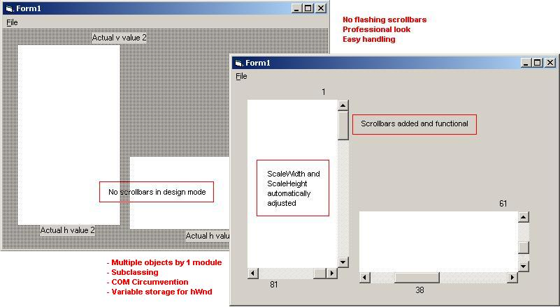



## Professional Scrollbars, Subclassing for multiple objects

### Description

Uses subclassing to provide *multiple* objects of your controls with professional scrollbars: No more annoying flashing scrollbars with a focus you can't get rid of. - Uses COM reference stealing and variables storing for hWnd windows.
 
### More Info
 
The code is heavily documented, and it is pretty short, read it - manipulations in the code may lead to crashes.

             |
---                |---
**Submitted On**   |2005-11-11 01:30:08
**By**             |[Herbert Glarner](https://github.com/Planet-Source-Code/PSCIndex/blob/master/ByAuthor/herbert-glarner.md)
**Level**          |Advanced
**User Rating**    |5.0 (15 globes from 3 users)
**Compatibility**  |VB 6\.0
**Category**       |[Windows API Call/ Explanation](https://github.com/Planet-Source-Code/PSCIndex/blob/master/ByCategory/windows-api-call-explanation__1-39.md)
**World**          |[Visual Basic](https://github.com/Planet-Source-Code/PSCIndex/blob/master/ByWorld/visual-basic.md)
**Archive File**   |[Profession19475111112005\.zip](https://github.com/Planet-Source-Code/herbert-glarner-professional-scrollbars-subclassing-for-multiple-objects__1-63230/archive/master.zip)

